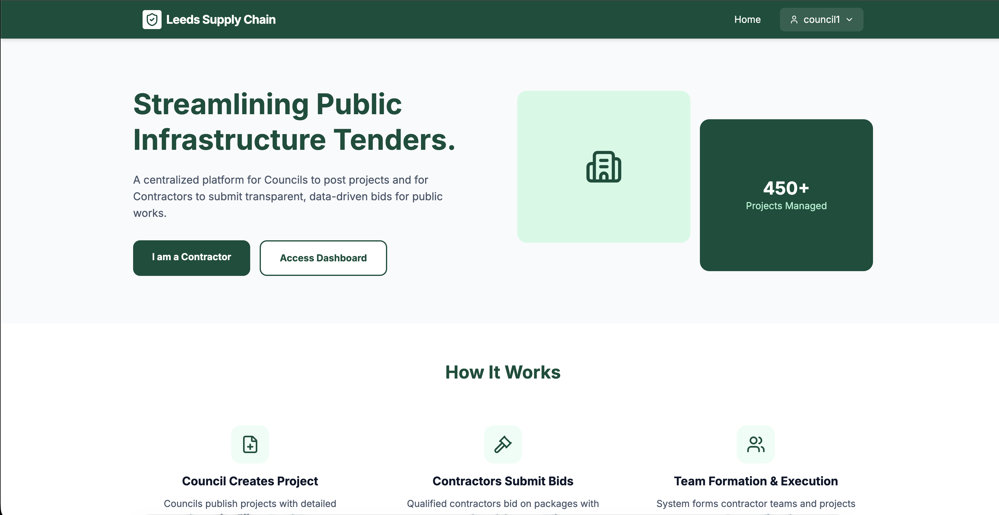
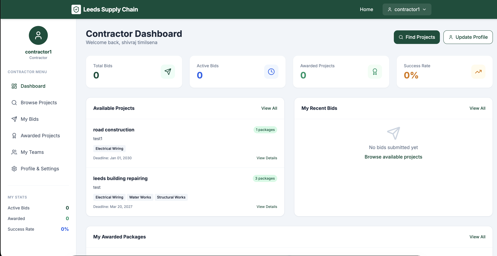
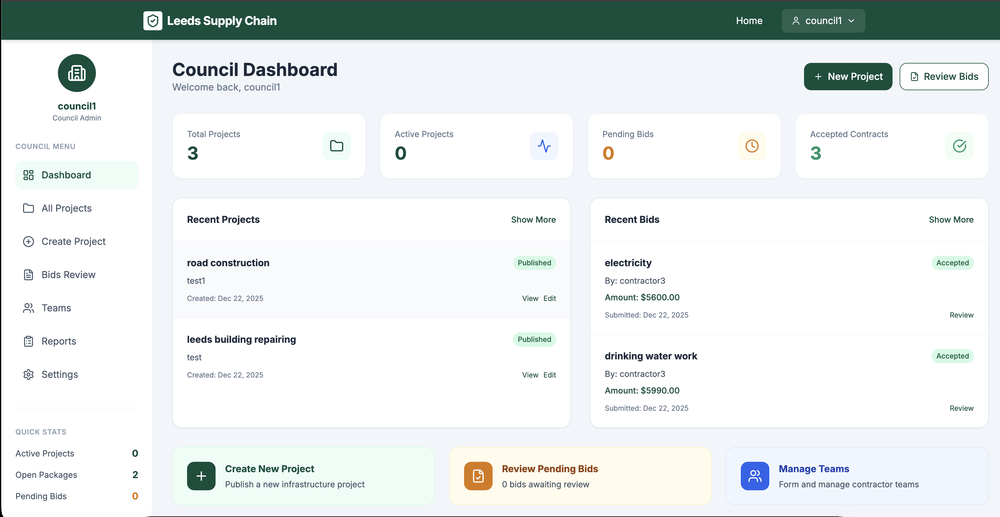
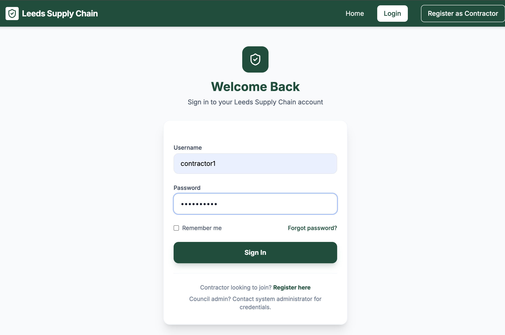

# 🏗️ Bidding Platform for Tenders & Project Management

A comprehensive Django-based web application for managing government/council tenders, contractor bidding, and project management. Built with Django 5.2.6 and Python 3.14.


## 📋 Table of Contents

- [Features](#-features)
- [Tech Stack](#-tech-stack)
- [Project Structure](#-project-structure)
- [Installation](#-installation)
- [Usage](#-usage)
- [API Endpoints](#-api-endpoints)
- [Screenshots](#-screenshots)
- [Contributing](#-contributing)
- [License](#-license)


## login credentials
### council
username = council1
pass = sagar@123#
### contractor
username = contractor1
password = sagar@123#

## ✨ Features

### For Councils (Government Bodies)
- 📝 Create and manage infrastructure projects
- 📦 Organize projects into packages for bidding
- 👥 Review contractor bids and proposals
- ✅ Award contracts to qualified contractors
- 📊 Generate comprehensive reports (Progress, Financial, Quality, Completion)
- 📈 Analytics dashboard for bid insights

### For Contractors
- 🔍 Browse available projects and tenders
- 📄 Submit detailed bid proposals with documentation
- 👷 Manage team members and assignments
- 📋 Track bid status and awarded projects
- 💡 AI-powered bid suggestions based on profile
- 📊 View personal analytics and success rates

### Core Features
- 🔐 Role-based authentication (Council/Contractor)
- 👤 User profiles with verification system
- 📁 Document upload for licenses and proposals
- 🔔 Notification system for bid updates
- 📱 Responsive design for all devices
- 📄 PDF report generation

## 🛠️ Tech Stack

| Technology | Purpose |
|------------|---------|
| **Django 5.2.6** | Web Framework |
| **Python 3.14** | Programming Language |
| **SQLite** | Database (Development) |
| **Tailwind CSS** | Utility-First CSS Framework |
| **Lucide Icons** | Modern Icon Library |
| **HTML5/CSS3** | Frontend Templates |
| **JavaScript** | Interactive Features |
| **ReportLab** | PDF Generation |

## 📁 Project Structure

```
├── Django Project/
│   ├── manage.py                 # Django management script
│   ├── myproject/                # Main project configuration
│   │   ├── settings.py           # Django settings
│   │   ├── urls.py               # Root URL configuration
│   │   ├── wsgi.py               # WSGI entry point
│   │   └── asgi.py               # ASGI entry point
│   ├── supply_chain/             # Main application
│   │   ├── models.py             # Database models
│   │   ├── views.py              # View logic
│   │   ├── forms.py              # Form definitions
│   │   ├── urls.py               # App URL routing
│   │   ├── admin.py              # Admin configuration
│   │   ├── signals_impl.py       # Django signals
│   │   ├── templates/            # HTML templates
│   │   ├── reports/              # PDF report utilities
│   │   ├── fixtures/             # Seed data
│   │   └── migrations/           # Database migrations
│   ├── static/                   # CSS, JS, Images
│   └── media/                    # User uploads
└── myenv/                        # Virtual environment
```

## 🚀 Installation

### Prerequisites
- Python 3.10 or higher
- pip (Python package manager)
- Git

### Setup Steps

1. **Clone the repository**
   ```bash
   git clone https://github.com/shivraj598/BIdding-platform-for-tenders-and-project-management-DJANGO.git
   cd BIdding-platform-for-tenders-and-project-management-DJANGO
   ```

2. **Create and activate virtual environment**
   ```bash
   python -m venv myenv
   
   # On macOS/Linux
   source myenv/bin/activate
   
   # On Windows
   myenv\Scripts\activate
   ```

3. **Install dependencies**
   ```bash
   pip install django django-model-utils pillow reportlab python-dotenv
   ```

4. **Navigate to Django project**
   ```bash
   cd "Django Project"
   ```

5. **Run migrations**
   ```bash
   python manage.py migrate
   ```

6. **Load sample data (optional)**
   ```bash
   python manage.py loaddata councils
   ```

7. **Create superuser**
   ```bash
   python manage.py createsuperuser
   ```

8. **Run development server**
   ```bash
   python manage.py runserver
   ```

9. **Access the application**
   - Main app: http://127.0.0.1:8000/
   - Admin panel: http://127.0.0.1:8000/admin/

## 📖 Usage

### Registration & Login
1. Navigate to `/register/` to create a new account
2. Choose your user type: **Council** or **Contractor**
3. Complete profile information
4. Login at `/login/`

### For Councils
1. Access dashboard at `/council/dashboard/`
2. Create new projects with details and timeline
3. Organize projects into bid packages
4. Review incoming contractor bids
5. Award contracts and track progress
6. Generate reports for monitoring

### For Contractors
1. Access dashboard at `/contractor/dashboard/`
2. Browse available projects at `/projects/available/`
3. Submit bids with proposal documents
4. View your bids at `/bids/my-bids/`
5. Manage awarded projects
6. Build and manage teams

## 🔗 Key Routes

| Route | Description |
|-------|-------------|
| `/` | Home page |
| `/register/` | User registration |
| `/login/` | User login |
| `/council/dashboard/` | Council dashboard |
| `/contractor/dashboard/` | Contractor dashboard |
| `/projects/` | Project listing |
| `/projects/available/` | Available projects for bidding |
| `/projects/create/` | Create new project (Council) |
| `/bids/my-bids/` | My submitted bids |
| `/bids/awarded/` | Awarded projects |
| `/teams/` | Team management |
| `/reports/` | Report generation |
| `/analytics/` | Bid analytics |
| `/profile/` | User profile |

## 📊 Database Models

- **User** - Extended Django user with contractor/council roles
- **Council** - Government body information
- **Project** - Infrastructure project details
- **Package** - Grouping of projects for bidding
- **Bid** - Contractor bid submissions
- **ContractorTeam** - Team management for contractors
- **Report** - Generated project reports
- **Notification** - User notifications

## 📸 Screenshots

### Home Page
*Streamlined public infrastructure tenders platform with clear call-to-actions*



### Contractor Dashboard
*Comprehensive dashboard showing bids, available projects, and statistics*



### Council Dashboard
*Admin view for managing projects, reviewing bids, and tracking contracts*



### Profile & Settings
*User profile management with personal and company information*



## 🤝 Contributing

Contributions are welcome! Please follow these steps:

1. Fork the repository
2. Create a feature branch (`git checkout -b feature/AmazingFeature`)
3. Commit changes (`git commit -m 'feat: add amazing feature'`)
4. Push to branch (`git push origin feature/AmazingFeature`)
5. Open a Pull Request

### Commit Convention
We use [Conventional Commits](https://www.conventionalcommits.org/):
- `feat:` - New features
- `fix:` - Bug fixes
- `docs:` - Documentation changes
- `chore:` - Maintenance tasks
- `refactor:` - Code refactoring

## 📄 License

This project is licensed under the MIT License - see the [LICENSE](LICENSE) file for details.

## 👨‍💻 Author

**Shivraj Timilsena**

- GitHub: [@shivraj598](https://github.com/shivraj598)

---

⭐ Star this repository if you find it helpful!
